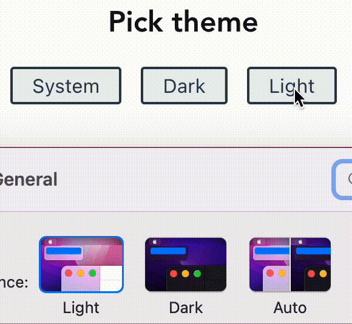

# vuejs-dark-mode

This little project shows how you can add dark mode support to your vue.js website taking both the system color scheme preference and the user preference into account.



## Project setup
```
npm install
```

### Compiles and hot-reloads for development
```
npm run serve
```

### Compiles and minifies for production
```
npm run build
```

### Lints and fixes files
```
npm run lint
```

### Customize configuration
See [Configuration Reference](https://cli.vuejs.org/config/).
